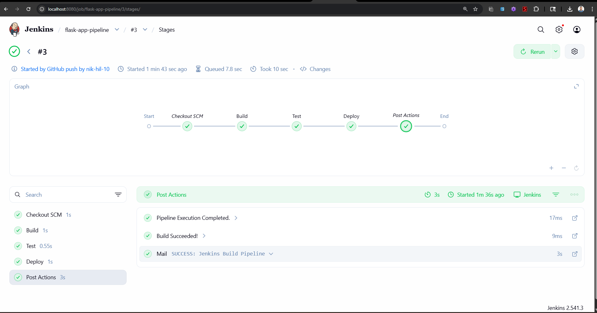
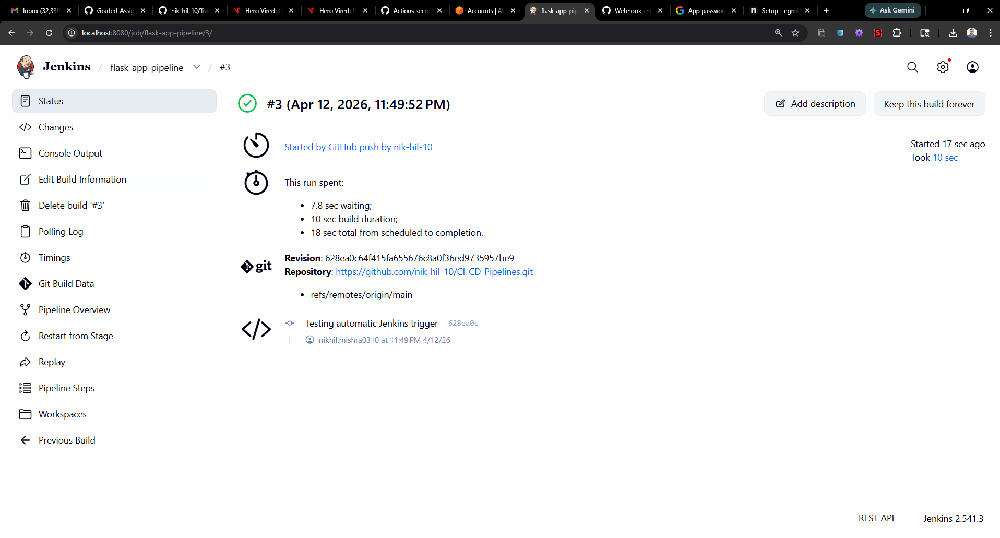
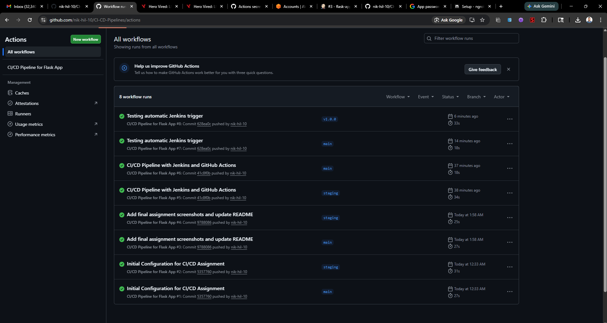
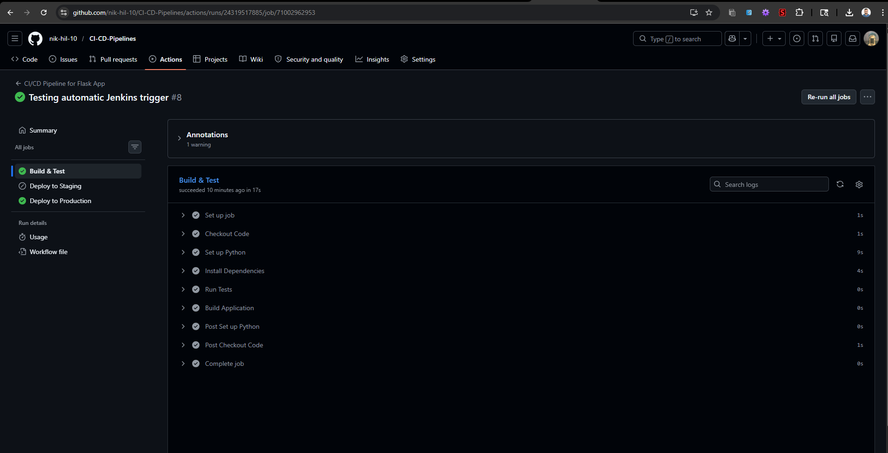

# CI/CD Pipelines for Flask Application

## Overview

This project demonstrates CI/CD pipeline implementation for a Python Flask web application using two approaches:
1. **Jenkins Pipeline** — hosted locally via Docker with automated GitHub webhook triggers, SSH-based deployment to an AWS EC2 staging server, and email notifications.
2. **GitHub Actions Workflow** — cloud-native CI/CD with branch-based staging deployments and tag-based production releases via SSH to AWS EC2.

## Prerequisites

- Python 3.9+
- Git
- Docker & Docker Compose
- An AWS EC2 instance (Ubuntu) for deployment
- A GitHub account

---

## 1. Jenkins CI/CD Pipeline

### Jenkins Environment

Jenkins runs inside a Docker container with Python 3 pre-installed. The `jenkins-setup/` directory contains the `Dockerfile` and `docker-compose.yml` used to build and run the Jenkins server.

To start Jenkins:
```bash
cd jenkins-setup/
docker-compose up -d --build
```

Access Jenkins at `http://localhost:8080`. The initial admin password can be retrieved using:
```bash
docker logs jenkins_server
```

### Pipeline Configuration

A Pipeline job named `flask-app-pipeline` is configured with:
- **SCM**: Git, pointing to this repository
- **Branch**: `*/main`
- **Script Path**: `Jenkinsfile`

### Automated Triggers

A GitHub Webhook is configured to notify Jenkins whenever code is pushed to the `main` branch. Jenkins is exposed to the internet using Ngrok, and the webhook payload URL is set to `<ngrok-url>/github-webhook/` in the repository's webhook settings.

### Pipeline Stages

The `Jenkinsfile` defines three stages:
- **Build**: Creates a Python virtual environment and installs dependencies from `requirements.txt` using `pip`.
- **Test**: Runs the test suite (`test_app.py`) using `pytest`.
- **Deploy**: On success, deploys the application to the AWS EC2 staging server via SSH using Jenkins credentials binding.

### Email Notifications

Jenkins is configured with SMTP (Gmail) under **Manage Jenkins → System → E-mail Notification**. The pipeline sends email alerts to `nikhil.mishra0310@gmail.com` on build success or failure using the `mail` step in the `post` block of the `Jenkinsfile`.

### Jenkins Pipeline Screenshots




---

## 2. GitHub Actions CI/CD Pipeline

### Workflow Configuration

The workflow is defined in `.github/workflows/main.yml`. It triggers on:
- Pushes to `main` and `staging` branches
- Tag pushes matching `v*` (e.g., `v1.0.0`)
- Pull requests to `main` and `staging`

### Environment Secrets

The following GitHub Secrets are configured under **Settings → Secrets and variables → Actions**:

| Secret | Purpose |
|--------|---------|
| `STAGING_HOST` | IP address of the staging EC2 instance |
| `STAGING_USER` | SSH username for the staging server |
| `STAGING_KEY` | SSH private key for staging server access |
| `PROD_HOST` | IP address of the production EC2 instance |
| `PROD_USER` | SSH username for the production server |
| `PROD_KEY` | SSH private key for production server access |

### Workflow Jobs

- **Build & Test**: Checks out the code, sets up Python 3.9, installs dependencies, runs `pytest`, and packages the application.
- **Deploy to Staging**: Runs only on pushes to the `staging` branch. Connects to the staging server via SSH using `appleboy/ssh-action` and deploys the application.
- **Deploy to Production**: Runs only when a release tag (`v*`) is pushed. Connects to the production server via SSH and deploys the tagged release.

### GitHub Actions Screenshots


