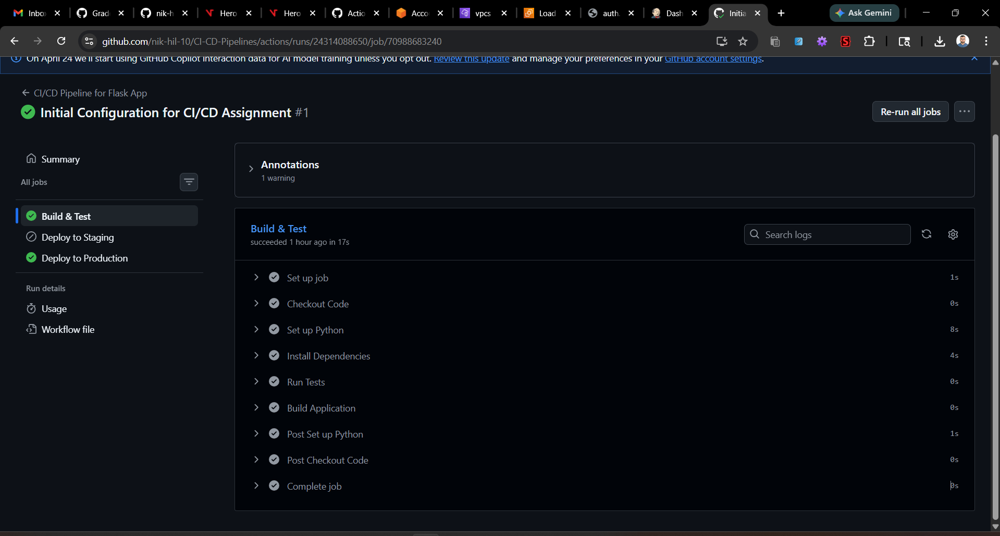

# CI/CD pipelines for Flask Application

This repository is my submission for the CI/CD Pipeline assignment. It contains a simple Python Flask application and demonstrates two distinct CI/CD architectures:
1. A Jenkins Automation Pipeline
2. A GitHub Actions Workflow

## Project Prerequisites
- **Python 3.9+** (For local execution and testing)
- **Git**
- **Docker & Docker Compose** (Optional, but used here to easily deploy Jenkins locally)
- A GitHub Account

---

## 1. Jenkins CI/CD Pipeline

### Setup and Configuration
For this assignment, I structured my Jenkins environment using Docker so it would come pre-packaged with Python 3, allowing it to easily test my Flask app.

**Steps to run Jenkins locally:**
1. Navigate to the `jenkins-setup/` directory.
2. Run `docker-compose up -d --build`. This starts a Jenkins server on port 8080 with Python, Pip, and Venv pre-installed.
3. Access Jenkins at `http://localhost:8080` and unlock it using the initial admin password from `docker logs jenkins_server`.
4. Install the **"Suggested Plugins"** and create an admin user.
5. Create a new **Pipeline** Job named `flask-app-pipeline`.
6. Under the pipeline definition, choose `Pipeline script from SCM`, specify `Git`, and provide the repository URL. Ensure the script path is `Jenkinsfile`.

**Jenkins Automated Triggers (Requirement #4):**
To ensure the pipeline triggers automatically whenever code is pushed to `main`, configure a webhook mapping from GitHub to the Jenkins URL. Alternatively, under the Jenkins Job Configuration, navigate to **Build Triggers**, check **Poll SCM**, and enter `* * * * *` so Jenkins automatically listens for new commits.

### Pipeline Stages
My `Jenkinsfile` contains the following stages:
- **Build**: Creates a virtual environment and installs dependencies using `pip`.
- **Test**: Runs my unit tests mapped in `test_app.py` using `pytest`.
- **Deploy**: If tests pass without error, triggers a live SSH deployment to the AWS Staging Environment.

### Pipeline Execution Screenshots

---

## 2. GitHub Actions CI/CD Pipeline

### Setup and Configuration
My GitHub Actions workflow is controlled entirely via `.github/workflows/main.yml`.

**Branches:**
- `main` branch
- `staging` branch

**Secrets:**
GitHub Secrets are used to mask sensitive data needed for my AWS server deployments.
1. Navigate to `Settings -> Secrets and variables -> Actions`.
2. Add three secrets: `STAGING_HOST` (The IP of the EC2 Server), `STAGING_USER` (e.g. `ubuntu`), and `STAGING_KEY` (The private .pem key).
3. These are securely referenced inside the `main.yml` workflow to perform the remote deployments!

### Workflow Jobs
My implemented workflow includes:
- **Install Dependencies**: Fetches `pip` requirements.
- **Run Tests**: Executes `pytest` to guarantee code integrity.
- **Build**: Packages the application.
- **Deploy to Staging**: Automatically connects via SSH and deploys when pushing to the `staging` branch.
- **Deploy to Production**: Automatically connects via SSH and deploys when a formal Release Tag is created tracking `main`!

### GitHub Actions Execution Screenshots
